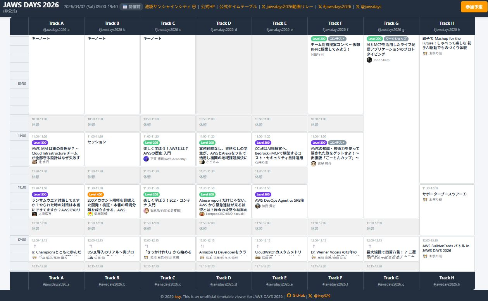
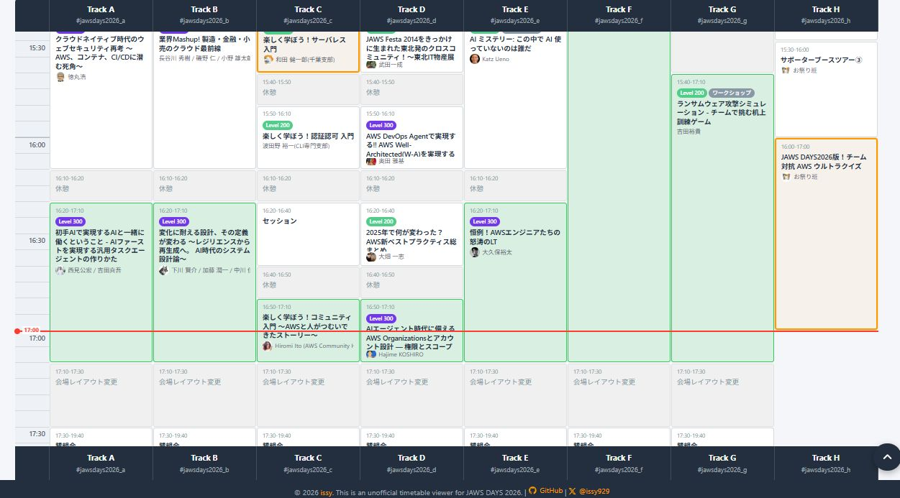
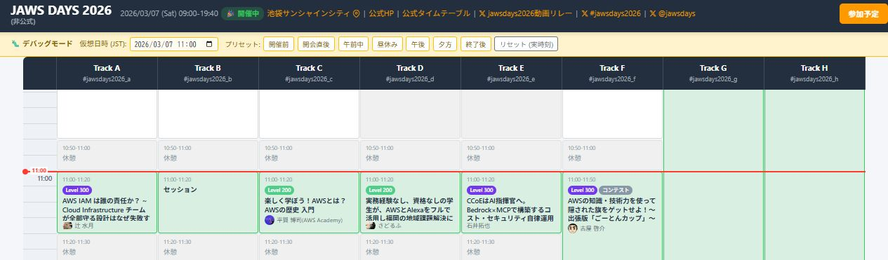
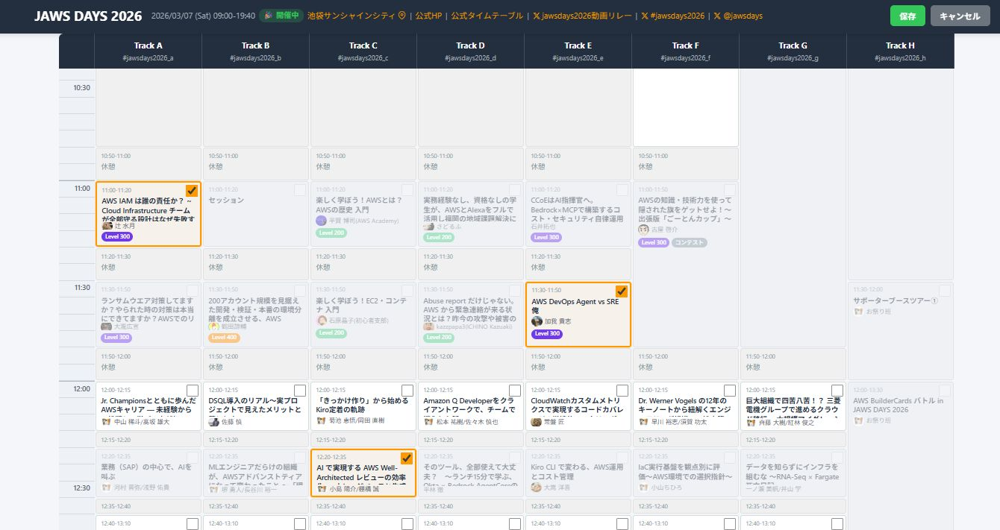

# JAWS DAYS 2026 カスタムタイムテーブル

JAWS DAYS 2026 の参加セッションを管理できる、インタラクティブなカスタムタイムテーブルです。

## GitHub Pages

**https://ishiharatma.github.io/aws-jawsdays2026-timetable-unofficial/**

## スクリーンショット

### 初期表示



### 開催中セッションの表示

イベント当日は、現在進行中のセッションが緑色でハイライト表示されます。



### デバッグモードによる開催中セッションの表示確認



### 参加予定の編集

「参加予定を編集」ボタンでチェックモードに切り替え、参加したいセッションにチェックを付けられます。



## イベント概要

- **日時**: 2026年3月7日 (土) 09:00 - 19:40
- **会場**: 池袋サンシャインシティ
- **公式サイト**: [JAWS DAYS 2026 - fortee.jp](https://fortee.jp/jawsdays-2026/timetable)
- **ハッシュタグ**: [#jawsdays2026](https://x.com/search?q=%23jawsdays2026)

## 機能

### タイムテーブル表示

- Track A〜H の8トラック同時表示
- CSS Grid レイアウトによる時間軸タイムテーブル
- セッション一覧にスピーカーのアイコン画像を表示
- Level バッジ表示（Level 200 / 300 / 400）

### セッション管理

- **参加予定を編集** ボタンでチェックモードに切り替え
- 参加したいセッションにチェックを付けて保存
- チェックしたセッションはオレンジ枠でハイライト表示
- 休憩・受付などの非セッション枠はチェック不可
- チェック状態はブラウザのクッキーに90日間保存

### セッション詳細

セッションをクリックするとモーダルで詳細を表示：
- スピーカーのアイコン画像と名前
- Level バッジ（色分け）
- Google カレンダーへの追加
- Fortee の Proposal ページへのリンク
- X (Twitter) への投稿

### その他

- イベント当日は現在進行中のセッションを緑色でハイライト
- ページ読み込み時に現在時刻（またはイベント開始時刻 10:00）へ自動スクロール
- テーブルヘッダーの固定表示（縦スクロール時にトラック名が見える）
- タイムテーブルの横スクロール対応
- ページトップへ戻るボタン

## Level バッジの色

fortee.jp のデザインに準拠しています：

| Level | カラーコード |
|-------|-------------|
| Level 200 | `#50cd89` (緑) |
| Level 300 | `#7239ea` (紫) |
| Level 400 | `#ff8f00` (オレンジ) |

## 技術仕様

- **フロントエンド**: HTML5 / CSS3 / Vanilla JavaScript（フレームワーク不使用）
- **データ**: `timetable.json`（173セッション、スピーカー画像URL含む）
- **状態管理**: ブラウザクッキー（チェック状態を90日間保存）
- **ホスティング**: GitHub Pages

## ファイル構成

```
public/
├── index.html       # メインHTML
├── app.js           # JavaScriptアプリケーション
├── style.css        # スタイルシート
└── timetable.json   # タイムテーブルデータ（173セッション）
docs/
├── spec.md          # 仕様書
├── development.md   # 開発ガイド
├── plan.md          # 実装計画
└── knowledge/       # 参考資料
```

## ライセンス

Apache License 2.0 - 詳細は [LICENSE](LICENSE) を参照してください。
